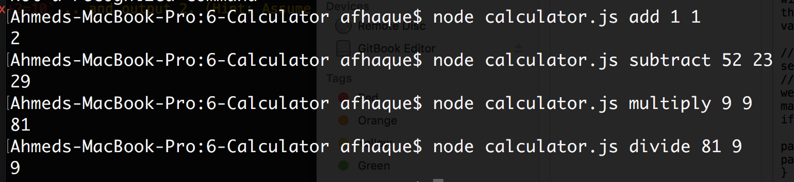
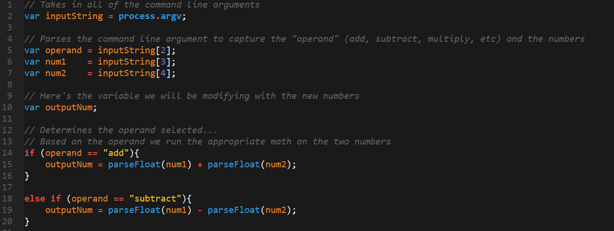

### Activity: Calculator.js

----

#### Instructions

* Create a command-line node application that takes in parameters like this:

	* `node calculator.js add 1 2` ... and outputs 3
	* `node calculator.js subtract 5 2` ... and outputs 3
	* `node calculator.js multiply 3 2` ... and outputs 6
	* `node calculator.js divide 8 2` ... and outputs 4
	* `node calculator.js remainder 7 2`... and outputs 1

* Bonus: Make your calculator application also handle the below cases:
	* `node calculator.js exp 7 2` ... and output 49 (7 squared)
	* `node calculator.js algebra 4x+2=10`... and output 2. (Hint: Assume the algebra will always be in this form and will always be addition)

#### Intended Result

----

#### Solution Notes

* In this example we made use of the node command `process.argv[]` to retrieve user inputs from the command line.

* We then saved each of the user inputs as variables for the numbers and operators.

* Depending on the operator we performed a different mathematical operation on those numbers.

* We then used `console.log` to output the result to the screen.

----

Copyright 2016 | The Coding Bootcamp
